# Mohamed Nasser

### AI Engineer | Mechatronics Specialist | Robotics & Computer Vision Developer

---

## 🚀 About Me

I'm a passionate **AI Engineer** and **Mechatronics specialist** dedicated to pushing the boundaries of intelligent systems. With expertise spanning **Computer Vision**, **Deep Learning**, and **Robotics**, I transform complex challenges into elegant, AI-driven solutions.

---

## 💡 Core Expertise

<table>
<tr>
<td align="center" width="50%">

**🤖 Artificial Intelligence**

Machine Learning • Deep Learning • Neural Networks  
Transfer Learning • GANs • Multi-Agent Systems  
Model Optimization • AI Deployment

</td>
<td align="center" width="50%">

**👁️ Computer Vision**

Object Detection • Image Segmentation  
Pose Estimation • Video Processing  
Visual Recognition • Object Tracking

</td>
</tr>
<tr>
<td align="center" width="50%">

**🦾 Robotics & Automation**

ROS 2 • SLAM • Autonomous Navigation  
Sensor Fusion • Motion Planning  
Path Planning • Embedded Systems

</td>
<td align="center" width="50%">

**📊 Data Science**

Data Analysis & Visualization  
Statistical Modeling • Feature Engineering  
Model Evaluation • Predictive Analytics

</td>
</tr>
</table>

---

## 🛠️ Technology Stack

### Programming Languages & Tools

  

### AI & Machine Learning

  
  
  
  

### Robotics & Embedded

  

### Development Tools

  

---

## 📊 GitHub Statistics

---

## 🎯 Comprehensive Learning Path

```mermaid
graph TD
    classDef center  fill:#16182a,stroke:#7B68EE,stroke-width:3px,color:#7B68EE
    classDef nav     fill:#161B22,stroke:#00d4aa,stroke-width:2px,color:#00d4aa
    classDef infra   fill:#161B22,stroke:#ffd166,stroke-width:2px,color:#ffd166
    classDef cv      fill:#161B22,stroke:#c77dff,stroke-width:2px,color:#c77dff
    classDef dl      fill:#161B22,stroke:#4cc9f0,stroke-width:2px,color:#4cc9f0
    classDef gen     fill:#161B22,stroke:#ff6b6b,stroke-width:2px,color:#ff6b6b

    LP((Learning Path))

    %% ROBOTICS INFRASTRUCTURE
    LP --> INFRA[Robotics Infrastructure]
    INFRA --> SIM[Simulation]
    INFRA --> COMM[Communication]
    SIM --> GAZ[Gazebo]
    SIM --> RVIZ[RViz]
    COMM --> ROS[ROS Bridge]
    COMM --> WS[WebSockets]

    %% AUTONOMOUS NAVIGATION
    LP --> NAV[Autonomous Navigation]
    NAV --> PP[Path Planning]
    NAV --> LOC[Localization]
    NAV --> OBS[Obstacle Avoidance]
    PP --> ASTAR[A* Algorithm]
    PP --> LOPT[Local Planner Opt]
    LOC --> AMCL[AMCL]
    LOC --> NAVS[Nav Stack]
    LOC --> AMC[Adaptive Monte Carlo]
    OBS --> DYN[Dynamic Detection]
    OBS --> COST[Costmap Config]

    %% COMPUTER VISION
    LP --> CV[Computer Vision]
    CV --> YOLO[YOLO]
    CV --> CNN[CNNs]
    CV --> DLIB[DLIB]
    CV --> FACE[Face Recognition]
    CV --> VIT[Vision Transformers]
    CV --> MP[MediaPipe]
    CV --> TL[Transfer Learning]
    VIT --> VITB[ViT]
    VIT --> SWIN[Swin Transformer]

    %% DEEP LEARNING
    LP --> DL[Deep Learning]
    DL --> ANN[ANNs]
    DL --> TR[Transformers]
    DL --> RNN[RNNs & GRUs]
    DL --> SEQ[Seq2Seq]
    DL --> LSTM[LSTM]

    %% GENERATIVE AI
    LP --> GEN[Generative AI]
    GEN --> LLM[LLMs]
    GEN --> DIFF[Diffusion Models]
    GEN --> GAN[GAN Models]
    GEN --> AGT[Agents]
    AGT --> MAS[Multi-Agent Systems]

    class LP center
    class NAV,PP,LOC,OBS,ASTAR,LOPT,AMCL,NAVS,AMC,DYN,COST nav
    class INFRA,SIM,COMM,GAZ,RVIZ,ROS,WS infra
    class CV,YOLO,CNN,DLIB,FACE,VIT,MP,TL,VITB,SWIN cv
    class DL,ANN,TR,RNN,SEQ,LSTM dl
    class GEN,LLM,DIFF,GAN,AGT,MAS gen
```

---

## 📂 Featured Projects

### 🤖 AI-Powered Systems

<table>
<tr>
<td width="50%">

#### [🤖 Autonomous Delivery Robot](https://github.com/MO-NASSER9/Autonomous-Delivery-Robot)
Autonomous navigation system with SLAM, path planning, and obstacle avoidance for delivery applications. Features real-time localization, dynamic obstacle detection, and multi-sensor fusion.

**Tech Stack:** `ROS 2` `Python` `C++` `Gazebo` `Navigation2` `SLAM` `LiDAR`

</td>
<td width="50%">

#### [🔧 Predictive Maintenance System](https://github.com/MO-NASSER9/predictive-maintenance-system)
AI-driven predictive maintenance using machine learning to forecast equipment failures and optimize maintenance schedules.

**Tech Stack:** `Python` `TensorFlow` `Scikit-learn` `IoT Sensors`

</td>
</tr>
<tr>
<td width="50%">

#### [🚗 Driver Behavior Monitoring](https://github.com/MO-NASSER9/Driver-Behavior-Monitoring)
Real-time driver behavior analysis system using computer vision and deep learning for safety monitoring and drowsiness detection.

**Tech Stack:** `OpenCV` `YOLO` `MediaPipe` `Python` `Deep Learning`

</td>
<td width="50%">

<!-- Add more projects here as needed -->

</td>
</tr>
</table>

---

## 📈 Contribution Activity

---

## 🎯 Skills Proficiency

---

### 💭 Philosophy

**"Code is poetry written in logic"**

