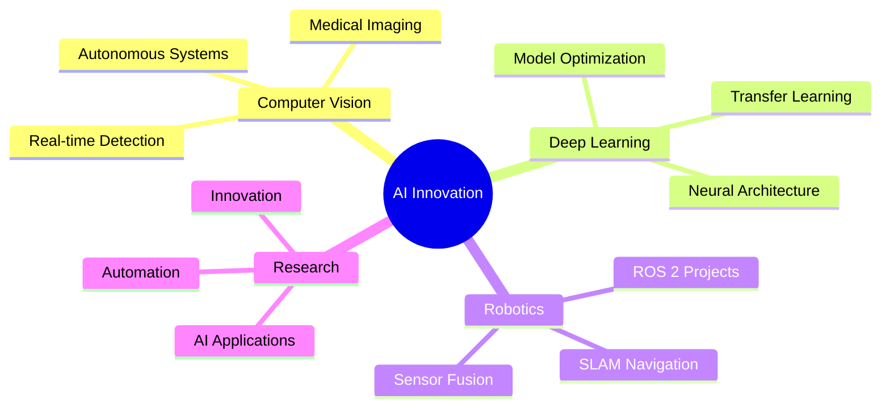

<div align="center">

# 👨‍💻 Mohamed Nasser

### AI Engineer | Mechatronics Engineer | Robotics & Computer Vision Specialist


[](https://mo-nasser9.github.io/)
[](https://flowcv.com/resume/8vsebds15gjq)
[](https://www.linkedin.com/in/mohamed-nasser-7857702b2/)
[](mailto:mohamed.bn.nasser2001@gmail.com)
[](https://wa.me/201027652773)


</div>

---

## 🚀 About Me

I'm a passionate **AI Engineer** and **Mechatronics specialist** dedicated to pushing the boundaries of intelligent systems. With expertise spanning **Computer Vision**, **Deep Learning**, and **Robotics**, I transform complex challenges into elegant, AI-driven solutions.
```python
class MohamedNasser:
    def __init__(self):
        self.role = "AI Engineer"
        self.expertise = ["Computer Vision", "Deep Learning", "Robotics"]
        self.current_focus = "Building next-gen intelligent automation systems"
        self.passion = "Transforming ideas into reality with AI"
    
    def say_hi(self):
        print("Thanks for visiting! Let's build something amazing together 🚀")

me = MohamedNasser()
me.say_hi()
```

---

## 💡 Core Expertise

<table>
<tr>
<td width="50%">

### 🤖 Artificial Intelligence
- **Machine Learning & Deep Learning**
- **Neural Networks Architecture**
- **Model Optimization & Fine-tuning**
- **Transfer Learning**
- **AI Inference & Deployment**

</td>
<td width="50%">

### 👁️ Computer Vision
- **Object Detection & Tracking**
- **Image Segmentation**
- **Pose Estimation**
- **Real-time Video Processing**
- **Visual Recognition Systems**

</td>
</tr>
<tr>
<td width="50%">

### 🦾 Robotics & Automation
- **ROS 2 Development**
- **SLAM & Navigation**
- **Sensor Integration**
- **Motion Planning**
- **Autonomous Systems**

</td>
<td width="50%">

### 📊 Data Science
- **Data Analysis & Visualization**
- **Statistical Modeling**
- **Feature Engineering**
- **Model Evaluation**
- **Predictive Analytics**

</td>
</tr>
</table>

---

## 🛠️ Technology Stack

### AI & Machine Learning
<p align="left">
  
  
  
  
</p>

**Frameworks & Libraries:**  
`PyTorch` `TensorFlow` `Keras` `Hugging Face Transformers` `OpenCV` `MediaPipe` `YOLO` `Scikit-learn` `NumPy` `Pandas` `Matplotlib` `Seaborn`

**Specializations:**  
`CNNs` `RNNs` `Transformers` `GANs` `Object Detection` `Semantic Segmentation` `Pose Estimation` `NLP`

---

### Robotics & Embedded Systems
<p align="left">
  
</p>

**Frameworks & Tools:**  
`ROS 2` `Gazebo` `RViz` `Navigation2` `SLAM (Gmapping, Cartographer)` `MoveIt` `Micro-ROS`

**Hardware:**  
`Arduino` `Raspberry Pi` `ESP32` `NVIDIA Jetson` `Sensors (LiDAR, IMU, Camera)`

---

### Programming & Development
<p align="left">
  
</p>

**Languages:** `Python` `C++` `C` `Bash` `MATLAB`  
**Tools:** `Git` `Docker` `VS Code` `Jupyter` `CMake`

---

## 📈 GitHub Analytics

<div align="center">
  


</div>

---

## 🏆 Achievements & Recognition

<div align="center">
  


</div>

---

## 🎯 Current Focus


---

## 📫 Let's Connect!

<div align="center">

### 💬 I'm always open to interesting conversations and collaboration opportunities!

<a href="https://mo-nasser9.github.io/">
  
</a>
<a href="https://flowcv.com/resume/8vsebds15gjq">
  
</a>

### 📧 **Email:** mohamed.bn.nasser2001@gmail.com  
### 📱 **Phone:** +20 102 765 2773

<br>

**🌟 If you like my work, consider giving a star to my repositories! 🌟**

</div>

---

<div align="center">

### 🎨 Skills Visualization


</div>

---

<div align="center">
  
**💻 "Code is poetry written in logic" 💻**


</div>
