# 👨‍💻 Mohamed Nasser

### AI Engineer | Mechatronics Specialist | Robotics & Computer Vision Developer

 

---

## 🚀 About Me

I'm a passionate **AI Engineer** and **Mechatronics specialist** dedicated to pushing the boundaries of intelligent systems. With expertise in **Computer Vision**, **Deep Learning**, and **Robotics**, I transform complex challenges into elegant, AI-driven solutions.

---

## 💡 Core Expertise

### 🤖 Artificial Intelligence
Machine Learning • Deep Learning • Neural Networks • Transfer Learning  
Model Optimization • GANs • Multi-Agent Systems • AI Deployment

### 👁️ Computer Vision
Object Detection & Tracking • Image Segmentation • Pose Estimation  
Real-time Video Processing • Visual Recognition • Medical Imaging

### 🦾 Robotics & Automation
ROS 2 Development • SLAM & Navigation • Sensor Fusion  
Motion Planning • Autonomous Systems • Embedded Programming

### 📊 Data Science
Data Analysis & Visualization • Statistical Modeling  
Feature Engineering • Predictive Analytics • Model Evaluation

---

## 🛠️ Technical Skills

### Programming Languages

### AI & Machine Learning

### Specialized AI Techniques

### Robotics & Hardware

### Tools & Platforms

---

## 📊 GitHub Statistics

---

## 🎯 Current Focus

```mermaid
%%{init: {'theme':'base', 'themeVariables': { 'primaryColor':'#1E90FF','primaryTextColor':'#FFFFFF','primaryBorderColor':'#00D9FF','lineColor':'#4169E1','secondaryColor':'#FF1493','tertiaryColor':'#32CD32','noteBkgColor':'#0D1117','noteTextColor':'#FFFFFF','noteBorderColor':'#00D9FF'}}}%%
mindmap
  root((🚀 AI Innovation))
    💡 Computer Vision
      🎯 Real-time Detection
      🏥 Medical Imaging
      🤖 Autonomous Systems
    🧠 Deep Learning
      ⚡ Model Optimization
      🔄 Transfer Learning
      🏗️ Neural Architecture
      🎨 GANs
    🦾 Robotics
      📡 ROS 2 Projects
      🗺️ SLAM Navigation
      🔗 Sensor Fusion
    🔬 Research
      🚀 AI Applications
      🤝 Multi-Agent Systems
      ⚙️ Automation
      💎 Innovation
```

---

## 📫 Get in Touch

### 💬 Let's collaborate and build something amazing together!

📧 **mohamed.bn.nasser2001@gmail.com** • 📱 **+20 102 765 2773**

 

 

💡 **Open to opportunities in AI, Computer Vision, and Robotics**

⭐ **If you find my work interesting, consider starring my repositories!**

---

**💻 "Transforming ideas into intelligent solutions" 💻**

