# 👨‍💻 Mohamed Nasser

### AI Engineer | Mechatronics Engineer | Robotics & Computer Vision Specialist

---

## 🚀 About Me

I'm a passionate **AI Engineer** and **Mechatronics specialist** dedicated to pushing the boundaries of intelligent systems. With expertise spanning **Computer Vision**, **Deep Learning**, and **Robotics**, I transform complex challenges into elegant, AI-driven solutions.

---

## 💡 Core Expertise

### 🤖 Artificial Intelligence

### 👁️ Computer Vision

### 🦾 Robotics & Automation

### 📊 Data Science

---

## 🛠️ Technology Stack

### AI & Machine Learning

  
  
  
  

### Robotics & Embedded Systems

  

### Programming & Development

  

---

## 📈 GitHub Analytics

  

---

## 🏆 GitHub Achievements

  

---

## 🎯 Current Focus

```mermaid
%%{init: {'theme':'base', 'themeVariables': { 'primaryColor':'#00D9FF','primaryTextColor':'#fff','primaryBorderColor':'#00D9FF','lineColor':'#00D9FF','secondaryColor':'#1a1a2e','tertiaryColor':'#16213e','background':'#0D1117','mainBkg':'#1a1a2e','secondBkg':'#16213e','tertiaryBkg':'#0f3460','textColor':'#ffffff','nodeBorder':'#00D9FF','clusterBkg':'#1a1a2e','clusterBorder':'#00D9FF','fontSize':'16px'}}}%%
mindmap
  root((🚀 AI Innovation))
    💡 Computer Vision
      🎯 Real-time Detection
      🏥 Medical Imaging
      🤖 Autonomous Systems
    🧠 Deep Learning
      ⚡ Model Optimization
      🔄 Transfer Learning
      🏗️ Neural Architecture
    🦾 Robotics
      📡 ROS 2 Projects
      🗺️ SLAM Navigation
      🔗 Sensor Fusion
    🔬 Research
      🚀 AI Applications
      ⚙️ Automation
      💎 Innovation
```

---

## 📫 Let's Connect!

### 💬 I'm always open to interesting conversations and collaboration opportunities!

📧 **Email:** mohamed.bn.nasser2001@gmail.com  
📱 **Phone:** +20 102 765 2773

 

**🌟 If you like my work, consider giving a star to my repositories! 🌟**

---

**💻 "Code is poetry written in logic" 💻**

